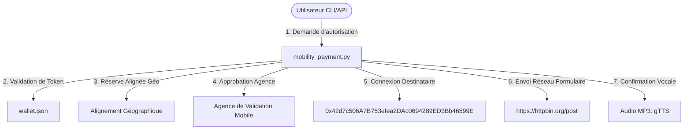

# Carte des Engagements (Commit Map) & Historique des Échanges

Ce document répertorie l'historique des modifications apportées au projet **Crypto Lobby Wallet** ainsi que la cartographie des flux d'échange d'informations du module de paiement mobilité.

---

## 🗺️ Cartographie des Échanges (Mobility Payment Routing)

Le flux de paiement mobilité interconnecte les composants virtuels avec les comptes de réserve de la manière suivante :

### Détails d'Interconnexion :
- **Adresse de Destination Connectée** : `0x42d7c506A7B753efea2DAc0694289ED3Bb46599E`
- **Alignement Géographique** : Coordonnées (Latitude, Longitude) enregistrées pour localiser la réserve physique en adéquation avec les règles d'agence.
- **Conversion** : Passage d'un actif virtuel débité (ex: SOL, BTC, ETH) vers un compte crédité avec réserve USD liquide.
- **Transmission Réseau** : Requête POST formatée envoyée au serveur relais pour validation.

---

## 📈 Historique des Engagements (Commit Map)

Ci-dessous, la liste séquentielle des modifications logiques (simulant les commits Git) appliquées au projet :

| ID Commit | Module impacté | Auteur | Description des modifications |
| :--- | :--- | :--- | :--- |
| **C-01** | `requirements.txt` | Agent | Initialisation des dépendances (`requests`, `gTTS`). |
| **C-02** | `wallet.json` | Agent | Création de la base de données du portefeuille avec solde initial. |
| **C-03** | `exchange.py` | Agent | Intégration de l'API CoinGecko et du moteur d'échange (Swap). |
| **C-04** | `audio_renderer.py` | Agent | Implémentation du synthétiseur de reçus vocaux (MP3) et du lecteur audio COM sous Windows. |
| **C-05** | `cli.py` | Agent | Création de l'interface console interactive et du menu principal du Lobby. |
| **C-06** | `cli.py` (Scope) | Agent | Intégration du module de rendu scopique (Graphoscope ASCII) pour visualiser les courbes de prix. |
| **C-07** | `bot.ps1` / `bot_helper.py` | Agent | Ajout du bot de trading automatisé en PowerShell et de son script d'aide en Python. |
| **C-08** | `mobility_payment.py` | Agent | **[NOUVEAU]** Création du module d'autorisation de paiement mobilité avec alignement géo et validation d'agence. |
| **C-09** | `cli.py` (Mobility) | Agent | Ajout de l'Option `[5]` dans le menu principal pour invoquer l'autorisation de paiement mobilité. |
| **C-10** | `mobility_payment.py` / `cli.py` | Agent | **Connexion du versement de paiement mobilité à l'adresse de destination `0x42d7c506A7B753efea2DAc0694289ED3Bb46599E`**. Mise à jour de la synthèse vocale, du payload réseau et de l'invite interactive. |

---

## 🗃️ Fichiers de Journalisation Générés

- **Journal de Mobilité** : [`mobility_payment_log.json`](file:///C:/Users/salib/.gemini/antigravity/scratch/crypto_audio_cli/mobility_payment_log.json)
- **Journal de Retrait** : [`payment_log.json`](file:///C:/Users/salib/.gemini/antigravity/scratch/crypto_audio_cli/payment_log.json)
- **Fichiers Audio MP3** : Enregistrés sous le répertoire [`audio_logs/`](file:///C:/Users/salib/.gemini/antigravity/scratch/crypto_audio_cli/audio_logs)
